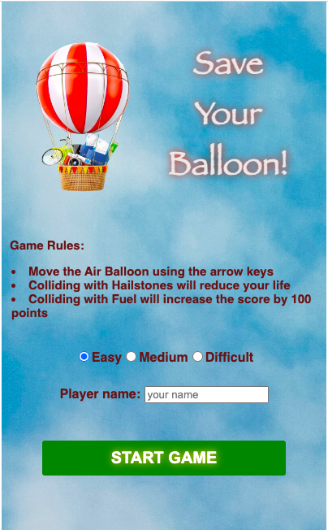

# Save Your Balloon Game

## Overview

Save Your Balloon is an exciting 2D game where players control an air balloon, trying to navigate through obstacles and collect fuel to increase their score. The game provides a thrilling experience with simple controls and engaging gameplay.

## Features

- **Simple Controls:** Use arrow keys to navigate the air balloon.
- **Obstacles:** Dodge hailstones to avoid losing lives.
- **Fuel:** Collect fuel to boost your score.
- **Multiple Difficulty Levels:** Choose from easy, medium, or difficult levels to tailor the challenge.

## Getting Started

1. Clone the repository: `git clone https://github.com/your-username/save-your-balloon.git`
2. Open `index.html` in your preferred web browser.

## How to Play

- Use the arrow keys (Up, Down, Left, Right) to control the air balloon.
- Collect fuel to increase your score.
- Avoid hailstones to prevent losing lives.

## Demo 
https://aliadossani.github.io/SaveYourBalloon/
